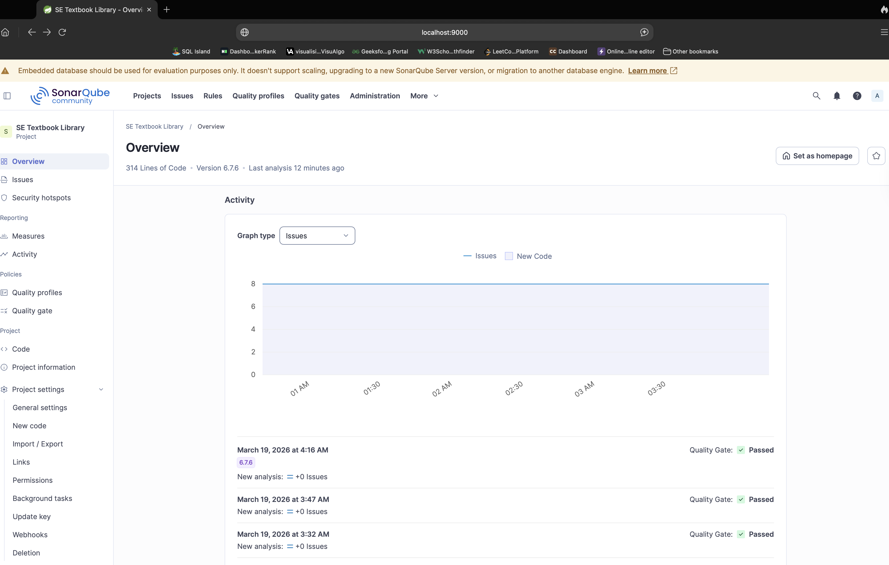
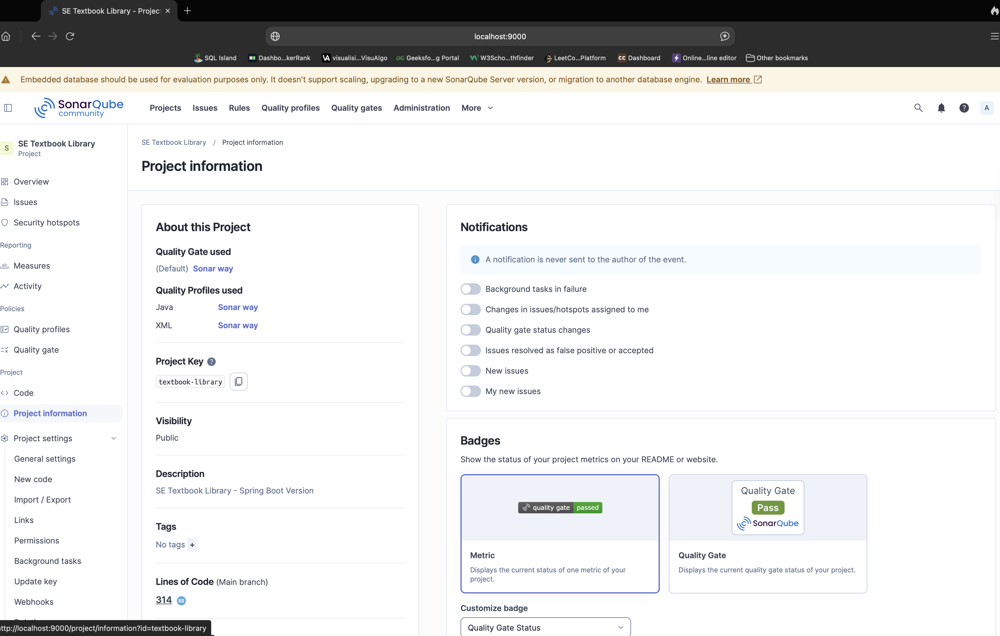
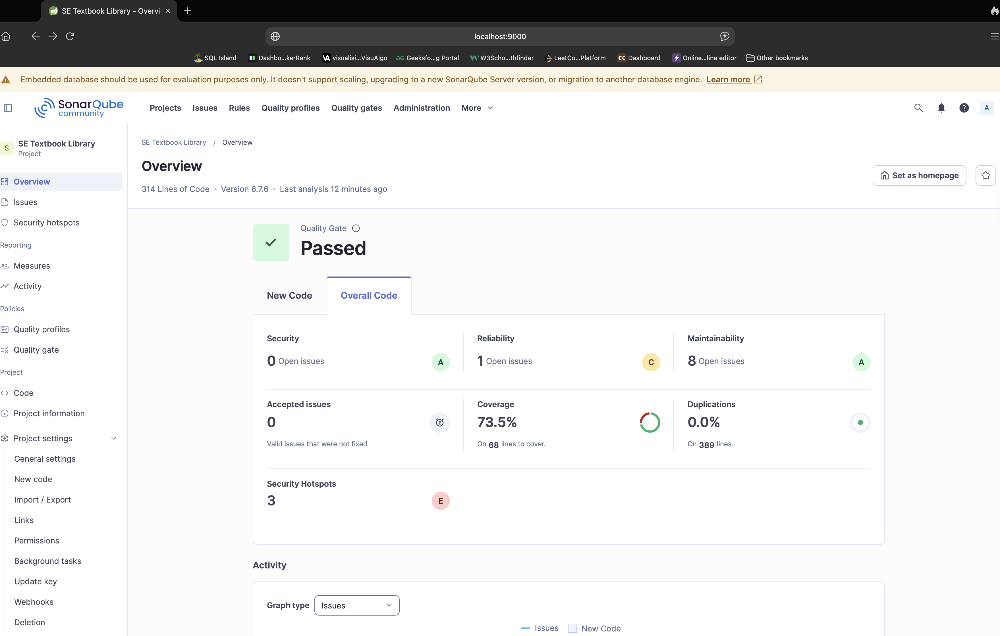

# Secure CI/CD Pipeline Implementation and Product Delivery

## Project Overview
This project demonstrates the design, implementation, and deployment of a secure CI/CD pipeline for the **SE Textbook Library** application. The pipeline automates source checkout, build, dependency scanning, testing, coverage reporting, static quality analysis, artifact packaging, containerization, infrastructure provisioning with Terraform, deployment to AWS EC2, and post deployment health validation.

The objective of this implementation is to show a complete delivery workflow in which code moves from commit to production through a series of automated quality and security gates.

---

## Stage C Questions

### Q. Does the build fail from running OWASP?
Yes. The build fails when OWASP Dependency Check detects a vulnerability that meets or exceeds the configured threshold.

In this project, the OWASP scan was configured using `-DfailBuildOnCVSS=9`.

This means the pipeline fails if a dependency with a critical vulnerability is found. During execution, OWASP detected critical vulnerabilities in project dependencies, which caused the build to fail intentionally. This confirms that the security gate is working correctly.

So, the build failure in this stage is not a Jenkins error. It is the expected security behavior of the OWASP scan configuration.

### Q. Now fix critical vulnerabilities by adjusting `pom.xml` in order to pass your pipeline.
During the OWASP Dependency Check stage, the pipeline failed because a critical vulnerability was detected in one of the project dependencies, specifically in the embedded Tomcat library brought in through Spring Boot.

To fix this issue, `pom.xml` was updated by upgrading the Spring Boot parent version to a newer secure release. Since Spring Boot manages the versions of its transitive dependencies, this upgrade also updated the vulnerable Tomcat components to patched versions.

After modifying `pom.xml` and rerunning the pipeline, the OWASP scan no longer detected critical vulnerabilities above the configured CVSS threshold, so the pipeline passed successfully.

### Q. What problem does dependency scanning solve that unit testing cannot detect?
Dependency scanning identifies known security vulnerabilities in third party libraries and transitive dependencies. Unit testing only checks whether the application behaves correctly for expected functionality. A project can pass all unit tests and still be unsafe because one of its dependencies contains a published CVE.

For example, a project may compile and all unit tests may pass while using a vulnerable version of `tomcat-embed-core`. The application works functionally, but OWASP Dependency Check can still flag that dependency because it has known critical vulnerabilities. In this project, the scan identified critical issues in dependencies even though the application build and tests were otherwise successful before the version upgrade.

### Q. The pipeline fails when CVSS ≥ 9. Why might an organization choose a different threshold, and what tradeoffs does this create?
An organization may choose a lower threshold like 7 if it wants stricter security enforcement and wants to stop builds for both high and critical vulnerabilities. This improves security and reduces the chance of risky software reaching production, but it can also cause more build failures, more developer interruptions, and slower delivery.

An organization may choose a higher threshold like 10 if it wants to reduce disruption and only block builds for the most severe vulnerabilities. This makes the pipeline less noisy and helps teams deliver faster, but it also increases the risk that serious vulnerabilities remain in the application longer.

So the tradeoff is between security strictness and delivery speed or developer productivity. A lower threshold gives stronger protection but more interruptions, while a higher threshold gives fewer interruptions but accepts more security risk.

---

## Stage E Questions

### Q. Did the test pass or fail?
The unit test stage passed successfully. Jenkins executed `mvn test`, generated the JUnit reports, and published the test results in Jenkins.

### Q. Why do we exclude integration tests?
Integration tests are excluded from the unit test phase because they are slower and depend on external components such as databases, services, or application context setup. Unit tests are meant to be fast, isolated, and reliable, so Jenkins should run them separately and publish only unit test reports during the `mvn test` stage.

This keeps the unit test stage clean, faster, and easier to interpret, while integration tests can be executed independently in a later pipeline stage.

---

## Stage F Questions

### F1

#### Q. Did this test pass or fail?
Without the `integration-tests` profile, `mvn test` runs only the unit tests, and they passed successfully.

With the `integration-tests` profile enabled, the integration tests also passed successfully because the required MongoDB environment was available and the profile was configured correctly to run only `*IntegrationTests.java`.

### F2

#### Q. Why do we use `catchError`?
We use `catchError` so that integration test failures are treated as an important quality signal without stopping the rest of the delivery pipeline. This allows Jenkins to mark the stage as unstable and still produce useful later outputs such as reports, scans, and artifacts.

The integration test stage was updated using `catchError(buildResult: 'SUCCESS', stageResult: 'UNSTABLE')`. This configuration allows Jenkins to continue the pipeline even if integration tests fail. Instead of stopping execution immediately, Jenkins marks the integration test stage as **UNSTABLE**, which provides a visible warning while still allowing later stages such as coverage, SonarQube analysis, quality gate, and packaging to run.

In the observed pipeline execution, the integration tests passed, so the `catchError` behavior was not triggered, but the stage configuration is in place and ready to handle failures correctly.

### F3

#### Q. What is the role of a Maven profile in managing integration tests?
A Maven profile allows you to change build behavior for specific situations without changing the default build. In this project, the `integration-tests` profile is used to run integration tests separately from unit tests. This makes it possible to keep the normal `mvn test` command fast and simple, while still allowing integration tests to be executed only when explicitly needed.

#### Q. Why are integration tests separated from unit tests in CI pipelines? Explain in terms of execution time, dependencies, and reliability.
Integration tests are separated from unit tests because they are usually slower, depend on external resources, and are more environment sensitive. Unit tests are fast, isolated, and reliable because they usually use mocks and do not depend on services such as databases or containers.

Integration tests often require real systems like MongoDB, Docker, APIs, or network resources, so they take longer and are more likely to fail because of environment issues rather than pure code logic. Separating them makes CI pipelines faster, clearer, and easier to debug.

#### Q. Although we skipped integration test here, why might be the reason for its failure?
An integration test may fail because the required external dependency is not available or not configured correctly. In this project, possible reasons include MongoDB not running, incorrect test profile configuration, missing environment variables, database connection issues, port conflicts, or Docker or Testcontainers related problems.

Integration tests may also fail even when the application code is correct if the surrounding environment is not ready.

The final integration test step publishes test results using the JUnit plugin so that Jenkins can display them in the job UI. In this project, integration test reports were published from `target/failsafe-reports/*.xml`. This allows Jenkins to show the result of integration test execution even if the stage is marked unstable.

Maven profiles were used to manage integration test execution separately from unit tests, which helps keep the default build fast and reliable.

---

## Stage G Questions

### Q. If a coverage stage is marked UNSTABLE, what are the causes?
A code coverage stage may be marked **UNSTABLE** when coverage report generation or publishing has a problem, but the pipeline is configured with `catchError` so execution continues.

Common causes include missing JaCoCo output files, report generation failure, test execution not producing coverage data, incorrect report path, or HTML publishing issues. In that situation, Jenkins flags the stage as unstable to show risk, but it does not stop later stages.

---

## Stage H Questions

### Q. Screenshot of SonarQube showing a new analysis for your project key

> 

> 

### Q. Screenshot of Sonar project dashboard summary

> 

---

## Task 0 — Architectural Diagram

### Pipeline Architecture

> 

### Architecture Description
The pipeline begins when source code is pushed to the GitHub repository. Jenkins pulls the latest code and executes the CI/CD workflow on the Jenkins controller. The application is first built with Maven, then scanned using OWASP Dependency Check and dependency audit steps. After the security checks, the pipeline runs unit tests, integration tests, and generates JaCoCo coverage reports. SonarQube analysis is then executed to evaluate code quality and enforce the quality gate.

If the quality checks pass, Jenkins packages the Spring Boot application as a JAR file, builds a Docker image, and pushes the image to DockerHub. Terraform is then used to provision AWS infrastructure, including the EC2 instance and security group. After infrastructure creation, Jenkins connects to the provisioned EC2 instance using SSH, pulls the latest Docker image from DockerHub, starts the containerized application, and performs a health check against the deployed service. For observability, AWS CloudWatch is used to view EC2 metrics and configure an alarm for runtime monitoring.

### Design Choices and Deviations from the Reference Pipeline
This implementation follows the reference flow of **commit → build → scan → test → package → deploy → monitor**, but a few design choices were made based on the project environment and available tooling.

First, deployment was implemented on an **AWS EC2 instance using Docker** rather than a more complex orchestration platform such as ECS or Kubernetes. This choice keeps the deployment architecture easier to understand and aligns well with the scope of the course project while still demonstrating infrastructure as code, remote deployment, and runtime validation.

Second, the pipeline includes **both unit tests and integration tests as separate stages**. This is a useful deviation because it improves clarity in Jenkins by showing isolated validation steps. Unit tests verify application logic quickly, while integration tests validate behavior with external dependencies in a dedicated stage.

Third, the integration test and coverage stages were configured to use **controlled error handling** so the pipeline can still publish reports and diagnostics when a noncritical problem occurs. This makes the pipeline more informative and easier to debug while still surfacing quality risks through stage status.

Fourth, container delivery was implemented with **DockerHub as the image registry**. This was selected because it is simple to configure, integrates easily with Jenkins, and provides a visible public or private registry location for submission evidence.

Finally, monitoring was implemented with **AWS CloudWatch metrics and an EC2 alarm** instead of a full observability stack such as Prometheus and Grafana. This is a practical choice for the current architecture because the deployed system is a single EC2 hosted containerized service, and CloudWatch is the native monitoring service already integrated with AWS resources.

---

## Task 1 — Evidence (Screenshots + Links)

### 1. Jenkins Full Pipeline Stage View

> 

> 

### Security, Testing, and Quality Reports

#### 2. OWASP Dependency Check Report Page (HTML)

> 

#### 3. Test Results Page (JUnit Summary)

> 

#### 4. JaCoCo Coverage Report Page (HTML)

> .png>)

#### 5. SonarQube Project Summary Dashboard

> 

#### 6. Archived Artifact (.jar) Visible in Jenkins Build

>  visible in Jenkins build.png>)

#### 7. Containerized Artifact

> 
> 

---

### Infrastructure Provisioning (Terraform)

#### 8. Terraform Apply Success Output

> 

#### 9. Terraform Output Showing Provisioned Resource Values

> 

#### 10. Deployed Infrastructure Visible in AWS Console

> 

---

### Deployment Verification

#### 11. Successful Request to the Deployed Service

> 

#### 12. Jenkins Console Log Snippet Showing Deployment and Health Check Validation

> 

> 

---

### Containerization and Registry Evidence

#### 13. Docker Image Built (Local or Jenkins Log)

> 

#### 14. Image Pushed to Container Registry (DockerHub or ECR)

> 

---

### Monitoring and Alerting (Optional)

#### 15. Metrics Dashboard or Equivalent Monitoring Tool

> 

#### 16. Configured Alarm (CPU, Health Check, etc.)

>

In this project, AWS CloudWatch was used to monitor the EC2 instance and configure an alarm on CPU utilization. If notification details are shown in the screenshot, any sensitive values should be redacted before submission.

---

## Task 3 — Answer Concept Questions (Short Answers)

### 1. When should we run parallel execution in Jenkins? What happens if there is a failure in one job?
Parallel execution should be used when two or more stages are independent and do not rely on each other’s output. In this pipeline, the dependency scanning tasks were good candidates for parallel execution because OWASP Dependency Check and the Maven dependency audit can run at the same time after the build stage. This reduces the total pipeline duration and improves efficiency.

If one parallel branch fails, Jenkins marks that branch as failed. Depending on pipeline configuration, the overall stage and build may also fail. In this project, some stages were configured with controlled error handling, so a noncritical issue could mark the stage as unstable instead of stopping the full pipeline immediately.

### 2. Why do we stash/unstash the Dependency Check report?
`stash` and `unstash` are used to temporarily save files generated in one stage and restore them in a later stage. In this pipeline, the OWASP Dependency Check reports are created during the scan stage and then restored in the publish stage so Jenkins can display the XML and HTML results. This ensures the reports remain available even when the pipeline moves between stages or workspace contexts.

### 3. What does `catchError(buildResult: 'SUCCESS', stageResult: 'UNSTABLE')` accomplish?
This configuration allows Jenkins to continue running the pipeline even if a command inside that stage fails. Instead of failing the whole build immediately, Jenkins marks only that stage as `UNSTABLE` while keeping the overall build result as `SUCCESS`. This is useful for stages like integration testing or coverage reporting where the results are important, but you still want later stages such as report publishing, SonarQube analysis, packaging, or deployment to continue.

### 4. Why is `jacoco.xml` useful for SonarQube?
`jacoco.xml` contains code coverage data generated by JaCoCo. SonarQube reads this file to import test coverage metrics and show how much of the source code is covered by automated tests. Without `jacoco.xml`, SonarQube can still analyze code quality issues, but it will not be able to report accurate coverage results for the project.

### 5. What is the difference between archiving artifacts vs just “files existing in the workspace”?
Files in the workspace are temporary build files that exist only during or shortly after pipeline execution. They can be deleted when the workspace is cleaned. Archived artifacts, on the other hand, are explicitly stored by Jenkins as part of the build record. This makes them available later for download, inspection, and submission evidence even after the workspace has been cleaned.

### 6. If the build fails, what is the first place you look?
The first place to check is the Jenkins console output for the failed build. The console log shows the exact stage, command, and error message that caused the failure. After identifying the failing stage, it is then easier to inspect related reports such as test results, OWASP reports, SonarQube output, Docker logs, or Terraform logs depending on where the issue happened.

---

## Task 4 — Discuss Challenges

### Challenges Encountered and Resolutions
During this project, I faced several practical challenges while building and deploying the CI/CD pipeline. One major issue was configuring secure remote deployment from Jenkins to the EC2 instance. At first, the pipeline did not have a proper SSH based deployment flow, so I had to install the SSH Agent plugin, add the EC2 private key as a Jenkins credential, and update the Jenkinsfile to use `sshagent` for remote access. After that, Jenkins was able to connect to the EC2 instance and run deployment commands securely.

Another challenge was related to Docker container execution and port mapping. While testing locally, I initially received errors such as invalid image reference format, container name conflicts, and port allocation conflicts. I resolved these by using the correct image name and tag, removing older containers, and making sure the host and container ports matched the application’s actual runtime port. I also verified the fix with `docker ps`, `docker logs`, and browser access to the application.

I also encountered confusion during deployment verification because the application was reachable, but some health related checks showed MongoDB connection issues. From the logs, I identified that the application container was trying to connect to MongoDB on `127.0.0.1:27017`, which was not running inside the deployment environment. Even though the main application page loaded successfully, the actuator health output showed the MongoDB component as down. I used `docker logs`, browser testing, and `curl` output to distinguish between application availability and backend dependency health.

Another challenge was collecting all required evidence for the README. Since the deliverable required screenshots from Jenkins, SonarQube, DockerHub, Terraform, AWS Console, deployment verification, and optional monitoring, I had to carefully navigate each tool and identify the exact pages that matched the assignment requirements. This took time because some evidence, such as the Jenkins stage overview, CloudWatch metrics, and alarms, was not immediately obvious. I resolved this by using the successful pipeline run as the main source of truth and then capturing screenshots from each service one by one.

Finally, monitoring setup required extra manual work because no alarm existed by default. I had to go into CloudWatch, select the EC2 metric, configure a CPU utilization threshold, and create an alarm so I could provide evidence of runtime observability. Although I did not configure advanced health based alarms, I successfully created a CPU alarm and captured the metrics and alarm pages as monitoring evidence.

Overall, the main blockers were SSH deployment setup, Docker runtime issues, deployment validation, and gathering the required proof for the final submission. I resolved them by checking Jenkins console output, Terraform output, Docker logs, browser access, and AWS CloudWatch pages until the full pipeline completed successfully end to end.

---