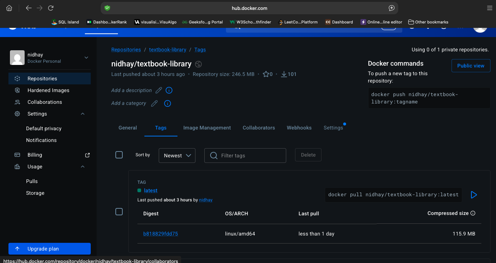

# Secure CI/CD Pipeline for SE Textbook Library

## Overview

This project showcases an end to end secure CI/CD pipeline for a Spring Boot based textbook library application. The pipeline automates build, dependency scanning, unit and integration testing, code coverage reporting, static code analysis, artifact packaging, Docker image creation, infrastructure provisioning with Terraform, deployment to AWS EC2, and post deployment health validation.

The goal of this project was to design a production style delivery workflow where every code change moves through automated quality, security, and deployment gates before reaching a live environment.

## Key Highlights

- Built an end to end CI/CD pipeline using **Jenkins**
- Integrated **OWASP Dependency Check** for dependency vulnerability scanning
- Added **unit tests** and **integration tests** as separate pipeline stages
- Generated code coverage reports with **JaCoCo**
- Integrated **SonarQube** for static analysis and quality gate enforcement
- Packaged the application as a deployable **JAR**
- Built and pushed Docker images to **DockerHub**
- Provisioned AWS infrastructure with **Terraform**
- Automated deployment to **AWS EC2**
- Validated deployment using HTTP health checks
- Added runtime monitoring evidence using **AWS CloudWatch**

## Tech Stack

- **Backend:** Java, Spring Boot, Maven
- **CI/CD:** Jenkins
- **Security Scanning:** OWASP Dependency Check
- **Testing:** JUnit, Maven Surefire, Maven Failsafe
- **Coverage:** JaCoCo
- **Code Quality:** SonarQube
- **Containerization:** Docker
- **Infrastructure as Code:** Terraform
- **Cloud:** AWS EC2, Security Groups, CloudWatch
- **Registry:** DockerHub

## Architecture


## Delivery Workflow

The pipeline implements the following workflow:

1. **Checkout**  
   Jenkins pulls the latest source code from GitHub.

2. **Build**  
   Maven compiles the application and validates the project structure.

3. **Dependency Scanning**  
   OWASP Dependency Check and Maven dependency auditing run in parallel to identify known vulnerabilities and outdated dependencies.

4. **Unit Testing**  
   Fast, isolated tests verify core application behavior.

5. **Integration Testing**  
   Integration tests run separately to validate application behavior with environment dependent components.

6. **Code Coverage**  
   JaCoCo generates XML and HTML coverage reports.

7. **Static Analysis and Quality Gate**  
   SonarQube analyzes the codebase and enforces quality gates before packaging and deployment continue.

8. **Packaging**  
   The application is packaged as a Spring Boot JAR artifact.

9. **Containerization**  
   A Docker image is built and tagged for versioned and latest releases.

10. **Infrastructure Provisioning**  
    Terraform provisions AWS resources including the EC2 instance and security group.

11. **Automated Deployment**  
    Jenkins connects to the provisioned EC2 instance, installs Docker if needed, pulls the latest image, and starts the containerized application.

12. **Post Deployment Validation**  
    A health check verifies that the deployed service is reachable and responding successfully.

## Security and Quality Controls

This pipeline was designed to include practical security and quality gates commonly used in modern delivery workflows.

### Dependency Vulnerability Scanning
OWASP Dependency Check was configured with:

```bash
-DfailBuildOnCVSS=9
```

This causes the build to fail automatically if a dependency contains a vulnerability with a CVSS score of 9 or higher. During development, the pipeline initially failed due to critical vulnerabilities in transitive dependencies. The issue was resolved by updating the Spring Boot parent version in `pom.xml`, which brought vulnerable embedded Tomcat dependencies to patched versions.

### Static Code Analysis
SonarQube was integrated to evaluate maintainability, code smells, and overall code quality. The pipeline also waits for the SonarQube quality gate result before continuing.

### Coverage Reporting
JaCoCo generates coverage reports, and SonarQube imports coverage data from `jacoco.xml` to provide visibility into test coverage.

## Testing Strategy

The project separates unit tests and integration tests into distinct pipeline stages.

### Unit Tests
Unit tests run during the standard `mvn test` phase and are intended to be fast, isolated, and reliable.

### Integration Tests
Integration tests run in a separate stage using Maven Failsafe. This improves pipeline clarity and keeps the default test phase lightweight.

The integration test stage uses:

```groovy
catchError(buildResult: 'SUCCESS', stageResult: 'UNSTABLE')
```

This allows Jenkins to continue the pipeline even if integration tests fail, while still clearly marking the stage as unstable. That makes the pipeline more informative and ensures later stages can still generate diagnostics, reports, and artifacts.

## Containerization and Deployment

After passing security and quality checks, the application is packaged and containerized.

### Docker
The pipeline builds and pushes the following image tags:

- `nidhay/textbook-library:40`
- `nidhay/textbook-library:latest`

### AWS Deployment
Terraform provisions the AWS infrastructure, and Jenkins deploys the application remotely to EC2 using SSH. The application container is started with:

- container name: `textbook-library`
- port mapping: `3001:3001`

### Health Validation
Deployment was verified with an HTTP request to the running service, which returned a successful `HTTP 200` response.

## Monitoring

AWS CloudWatch was used to capture EC2 metrics and create an alarm for runtime monitoring. For this implementation, CPU utilization was used as the monitoring signal and evidence of observability.

## Engineering Decisions

A few implementation choices were made to keep the project practical, understandable, and aligned with real world delivery patterns.

### EC2 + Docker Instead of Container Orchestration
The deployment target was an AWS EC2 instance running Docker rather than ECS or Kubernetes. This kept the system architecture simpler while still demonstrating containerized deployment, infrastructure provisioning, remote execution, and post deployment validation.

### Separate Unit and Integration Test Stages
Unit and integration tests were intentionally separated to improve pipeline speed, readability, and debugging. This makes it easier to identify whether failures are caused by application logic or by environment dependent behavior.

### Controlled Error Handling
Integration testing and coverage generation were configured with controlled error handling so that the pipeline can still publish reports and provide useful diagnostics even if those stages encounter noncritical issues.

### DockerHub as Image Registry
DockerHub was selected because it is simple to configure, easy to integrate with Jenkins, and suitable for demonstrating container build and push workflows.

### Native AWS Monitoring
CloudWatch was used instead of a larger observability stack because the deployed architecture is a single EC2 hosted containerized application. This was a practical fit for the project scope.

## Challenges and Resolutions

### Secure Remote Deployment from Jenkins
One challenge was enabling secure remote deployment to EC2. This was resolved by configuring the Jenkins SSH Agent plugin, storing the EC2 private key as a Jenkins credential, and updating the pipeline to use `sshagent` for remote execution.

### Docker Runtime Issues
During deployment validation, there were issues with incorrect image references, container conflicts, and port conflicts. These were resolved by using consistent image tags, removing older containers before starting new ones, and verifying runtime state with Docker commands and application access checks.

### Environment Dependent Health Signals
Another challenge came from distinguishing application availability from backend dependency health. The deployed application was reachable, but some health related output indicated MongoDB connection issues because MongoDB was not running at `127.0.0.1:27017` in the deployment environment. This required separating UI availability from deeper dependency health validation.

### Collecting End to End Delivery Evidence
Because the project spans multiple tools including Jenkins, SonarQube, DockerHub, Terraform, AWS, and CloudWatch, gathering final delivery evidence required validating outputs across several systems. The successful pipeline run served as the source of truth, and screenshots were collected from each stage of the workflow.

## Repository Structure

```text
.
├── Dockerfile
├── Jenkinsfile
├── README.md
├── Screenshots/
├── pom.xml
├── src/
│   ├── main/
│   └── test/
└── terraform/
```

## Screenshots and Evidence

### Jenkins Pipeline


### Dependency Scanning


### Test Results


### Coverage Report


### SonarQube Dashboard


### Packaged Artifact


### Containerization


### Terraform Provisioning


### AWS Infrastructure


### Deployment Validation


### Registry and Monitoring



## How to Run Locally

### Prerequisites

- Java 17 or compatible JDK
- Maven
- Docker
- Terraform
- AWS account and credentials
- Jenkins and SonarQube for full pipeline execution

### Application

```bash
mvn clean install
mvn spring-boot:run
```

The application should start locally on the configured application port.

### Tests

```bash
mvn test
mvn failsafe:integration-test failsafe:verify
```

### Docker

```bash
docker build -t textbook-library .
docker run -p 3001:3001 textbook-library
```

### Terraform

```bash
cd terraform
terraform init
terraform validate
terraform plan
```

## Summary

Built a secure CI/CD pipeline for a Spring Boot application using Jenkins, Docker, Terraform, AWS EC2, SonarQube, JaCoCo, and OWASP Dependency Check, automating build, testing, security scanning, containerization, infrastructure provisioning, deployment, and validation.
